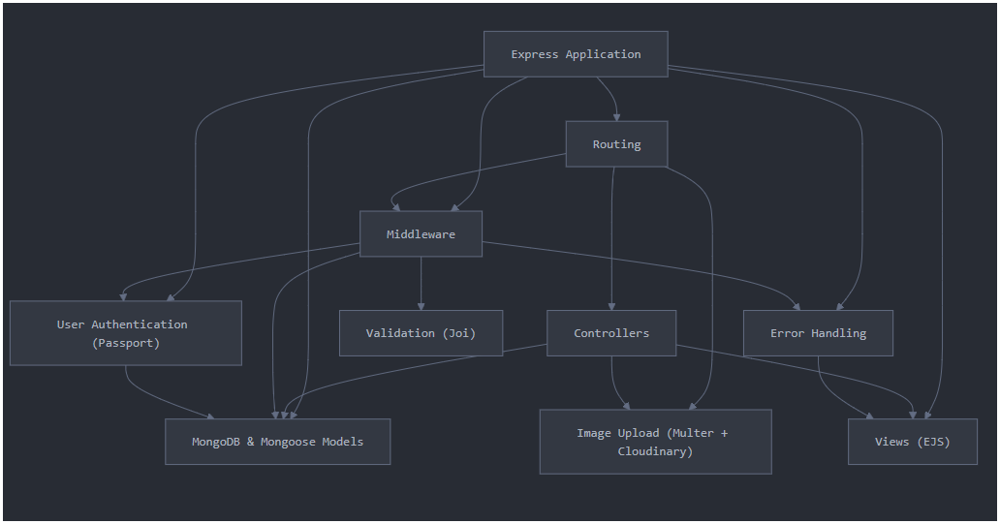

# 🏨 Restly – A Hotel Booking Platform

Restly is a full-stack web application that allows users to **browse**, **create**, **edit**, and **delete** hotel property listings. It also supports **user registration**, **login**, and **review submission** for listings. This platform demonstrates a complete backend integration using **Node.js**, **Express**, **MongoDB**, and **Passport.js**, with **EJS** as the templating engine.

---

## ✨ Features

- 🔐 **User Authentication & Authorization** (Passport.js)
- 🏨 **Create, Edit, Delete Hotel Listings**
- 💬 **Add and Manage User Reviews**
- 🖼️ **Image Uploads** with Multer and Cloudinary
- 🧾 **Server-side Validation** using Joi
- 🗃️ **MongoDB Database** with Mongoose ODM
- ⚠️ **Centralized Error Handling**
- 📐 **Clean MVC Architecture**

---

## 🗂️ Project Structure

```
Restly/
├── models/           # Mongoose data models
├── routes/           # All Express route files
├── controllers/      # Business logic for routes
├── views/            # EJS template files
├── public/           # Static assets (CSS, JS)
├── middleware/       # Custom middleware (auth, validation)
├── utils/            # Utility functions (e.g. ExpressError)
├── app.js            # Entry point of the app
└── .env              # Environment variables
```

---

## 🔧 Tech Stack

- **Backend:** Node.js, Express.js
- **Database:** MongoDB, Mongoose
- **Templating:** EJS
- **Authentication:** Passport.js
- **File Uploads:** Multer, Cloudinary
- **Validation:** Joi
- **Deployment Ready**

---

## 📊 Visual Architecture


## 🚀 Getting Started

### Prerequisites

- Node.js (v14 or higher)
- MongoDB Atlas or Local MongoDB
- Cloudinary account

### Environment Variables

Create a `.env` file in the root directory with the following:

```env
DB_URL=<your_mongo_connection_string>
CLOUDINARY_CLOUD_NAME=<your_cloud_name>
CLOUDINARY_KEY=<your_api_key>
CLOUDINARY_SECRET=<your_api_secret>
SECRET=<your_session_secret>
PORT=3000
```

### Installation

1. **Clone the repository**
   ```bash
   git clone https://github.com/Ayushbhusari22/restly-hotel-booking-platform.git
   cd restly-hotel-booking-platform
   ```

2. **Install dependencies**
   ```bash
   npm install
   ```

3. **Set up environment variables**
   - Copy `.env.example` to `.env`
   - Fill in your MongoDB and Cloudinary credentials

### Run the Application

```bash
npm start
```

Visit: [http://localhost:3000](http://localhost:3000)

### Development Mode

```bash
npm run dev
```

---

## 📋 API Endpoints

### Authentication Routes
- `GET /register` - User registration page
- `POST /register` - Register new user
- `GET /login` - Login page
- `POST /login` - Authenticate user
- `POST /logout` - Logout user

### Hotel Listing Routes
- `GET /listings` - View all listings
- `GET /listings/new` - Create new listing form
- `POST /listings` - Create new listing
- `GET /listings/:id` - View specific listing
- `GET /listings/:id/edit` - Edit listing form
- `PUT /listings/:id` - Update listing
- `DELETE /listings/:id` - Delete listing

### Review Routes
- `POST /listings/:id/reviews` - Add review
- `DELETE /listings/:id/reviews/:reviewId` - Delete review

---

## 🛠️ Key Dependencies

```json
{
  "express": "^4.18.2",
  "mongoose": "^7.0.3",
  "ejs": "^3.1.9",
  "passport": "^0.6.0",
  "passport-local": "^1.0.0",
  "passport-local-mongoose": "^8.0.0",
  "multer": "^1.4.5-lts.1",
  "cloudinary": "^1.37.3",
  "joi": "^17.9.2",
  "express-session": "^1.17.3",
  "connect-flash": "^0.1.1",
  "method-override": "^3.0.0"
}
```

---

## 🔒 Security Features

- **Password Hashing** with Passport Local Mongoose
- **Session Management** with Express Session
- **Input Validation** with Joi schemas
- **Authentication Middleware** for protected routes

---

## 🙏 Acknowledgments

- Inspired by modern hotel booking platforms
- Built as part of web development learning journey

---
